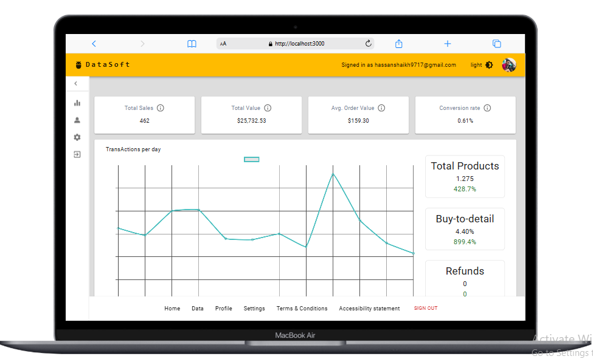
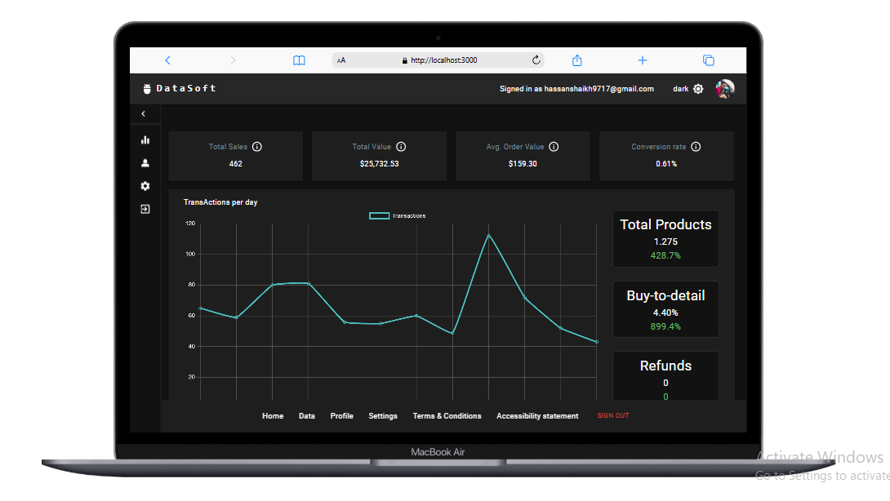

# Next.js-Dashboard-with-Authentication-Theming-and-Profile-Management

A feature-rich dashboard application built with Next.js, Material-UI (MUI), and Storybook, offering a seamless user experience with:

Authentication: OAuth-based sign-in and sign-out functionality.
Theming: Toggle between Dark Mode and Light Mode themes.
Profile Management: Edit and update user profile information.
Settings & Data Pages: Fully functional settings page and data management interface.
Component Library: Developed and documented UI components using Storybook.

This project demonstrates modern front-end development practices and responsive design principles, perfect for scalable and user-friendly web applications.

